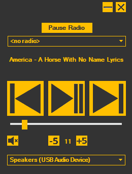

# Continuous Audio Overlay
A useful tool that enables the user to easily control audio volume, sources, and output devices. It is a Windows Forms application that has been developed using .NET 6.0.
It is especially useful to those that use remote desktop regularly, as it can become tiresome to always have to minimize all the remote desktop windows to adjust audio settings of the host machine.

## Features
- playing audio from various internet radio streams using BASS.NET
- advanced radio playback control (possible to pause radio, resume radio and switch to previous radio station)
- pausing, playing, and skipping songs on any music application that supports Windows Media Controls (YouTube, Spotify, foobar2000 and more)
- volume level control
- changing audio output devices (such as switching from headphones to speakers)
- name of current media (title and artist)
- thumbnail of current media (if available)
- appearing on top of other applications
- "folding" the application (making the application frame very small temporarily)

The application is still under development, and it's possible that more features will be added in the future.

## Adding internet radio streams
The user is able to add new internet radio streams to the application. New streams can be added by modifying RadioList.xml file (location: bin\Debug\net6.0-windows10.0.22621.0\RadioList.xml). By default, this file contains two exemplary internet radio streams. In the future it's going to be possible to manage the radio list using GUI. 

Preview of the application:

